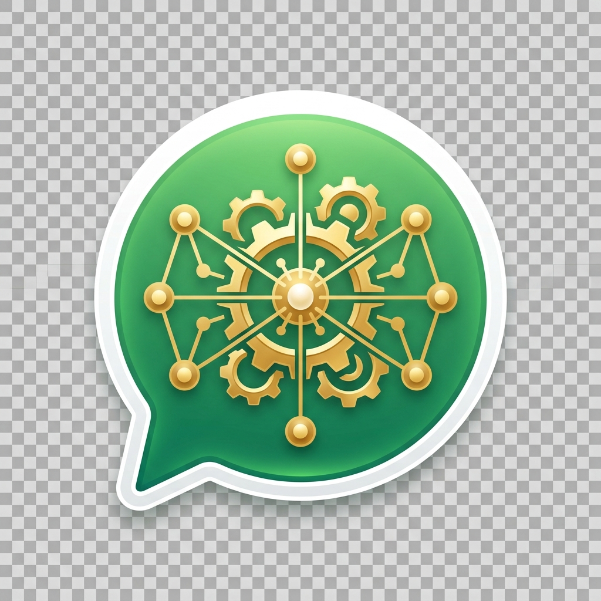

# WhatsApp CRM, Marketing, Cart Recovery by OnlineLiveSupport for n8n

<p align="center">
  
</p>

A premium, robust **n8n Community Node** that integrates the **WhatsApp CRM, Marketing, Cart Recovery** platform by **OnlineLiveSupport.com** directly into your n8n automation workflows. 

With this node, you can automate customer notifications, recover abandoned Shopify carts, run targeted marketing campaigns, and handle template messages programmatically.

---

## 🚀 Key Features

* **Send Raw WhatsApp Messages**: Dispatch standard custom WhatsApp API payloads (`POST /api/v1/send-message`).
* **Send Marketing Templates**: Trigger predefined WhatsApp templates with support for dynamic parameter variables and media URIs (`POST /api/v1/send_templet`).
* **API Logging Support**: Built-in toggle to record execution logs inside your WA CRM panel.
* **Multi-Environment Ready**: Connect seamlessly to a local development instance (`http://localhost:8002`) or your public production domain.

---

## 📦 Installation

To install this node inside your self-hosted or cloud n8n instance:

1. Log into your **n8n Dashboard**.
2. Navigate to **Settings > Community Nodes**.
3. Click **Install a Node** (or **Install community node**).
4. Enter the package name:
   ```text
   n8n-nodes-whatsapp-crm-marketing
   ```
5. Agree to the terms and click **Install**.

---

## 🔑 Configuration & Credentials

The integration requires a **WhatsApp CRM API** credential set:

1. **API Key**: Retrieve your JWT API key directly from your **WA CRM User Profile settings**.
2. **CRM Base URL**: Set this to your CRM domain:
   * Local testing: `http://localhost:8002`
   * Production: `https://crm.yourdomain.com`

---

## 🛠️ Actions & Parameters

### 1. Send Raw Message
* **Message Object (JSON)**: Input standard WhatsApp Business API payload.
  ```json
  {
    "messaging_product": "whatsapp",
    "recipient_type": "individual",
    "to": "RECIPIENT_NUMBER",
    "type": "text",
    "text": {
      "body": "Hello from n8n!"
    }
  }
  ```
* **Enable API Logging**: Boolean toggle.

### 2. Send Template
* **Send To**: Recipient number with country code (e.g. `+1234567890`).
* **Template Name**: Exact template name registered in Meta (e.g. `welcome_message`).
* **Template Parameters**: Dynamic variables mapping to `{{1}}`, `{{2}}`, etc.
* **Media URI**: Optional URL for templates with header images or videos.
* **Enable API Logging**: Boolean toggle.

---

## 📄 License

This integration is licensed under the [MIT License](LICENSE). Distributed by **[OnlineLiveSupport.com](https://onlinelivesupport.com)**.
